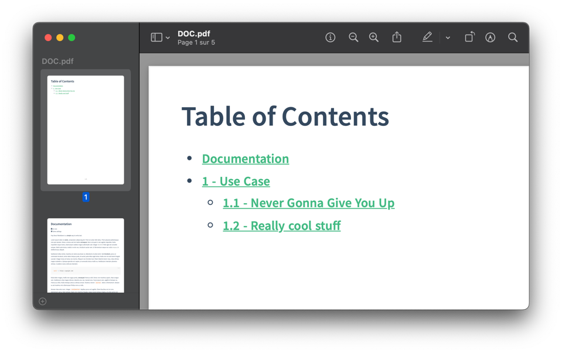
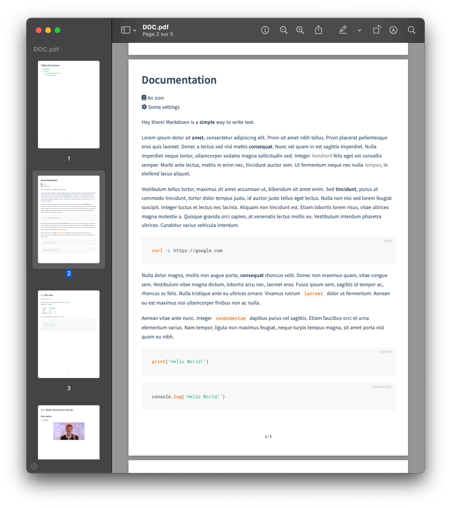

# Docker Docsify PDF


This project is based on [meff34/docsify-to-pdf-converter](https://github.com/meff34/docsify-to-pdf-converter/) repository.

## Features

- Custom **icons**
- **Codeblocks**
- **Table of contents** (auto-generated)
- **Multilingual** support (multiple sidebars)
- PDF **cover** page

> All improvements, fixes, differences from original repository are [here](#differences-from-original-repository).


## Screenshots






## Usage

First, create a documentation in a `docs` directory (like the repository example).  
You need a `_sidebar.md`[^1].

**Pull the image** and create output directory :
```bash
docker pull ghcr.io/kernoeb/docker-docsify-pdf:latest
mkdir -p $(pwd)/pdf
```

**Run the container** (volumes are mandatory) :
```bash
docker run --rm -it \
  --cap-add=SYS_ADMIN \
  --user $(id -u):$(id -g) \
  -v $(pwd)/docs:/home/node/docs:ro \
  -v $(pwd)/pdf:/home/node/pdf:rw \
  -v $(pwd)/resources/covers/cover.pdf:/home/node/resources/cover.pdf:ro \
  -e "PDF_OUTPUT_NAME=DOCUMENTATION.pdf" \
  ghcr.io/kernoeb/docker-docsify-pdf:latest
```

And voilà ! :tada:

---

You can use [zx](https://github.com/google/zx) to generate the PDF in one command : `zx README.md`.

You can also add custom js files _(plugins)_ : 

```bash
-v $(pwd)/resources/js/thing.js:/home/node/resources/js/thing.js:ro
```

> All the **resources** can be **replaced** (images, css, js, ...) as well   
> It can be useful if you want to change the **CSS theme**

The PDF **cover** is **optional** : just remove the mapping on the command.

## Differences from original repository

- Fix :
  - Slugify / internal **URL** (some URLs were not properly encoded)
  - `localhost` links are now disabled
  - **Codeblocks** (some code blocks were sliced)
  - Better margins in the final PDF
  - Page breaks between sections
  - If an image was used multiple times in the same section, it was not working
- Security/performance :
  - Update dependencies (Puppeteer, Docsify, ...)
- Feats :
  - **Table of content** (based on sidebar)
  - Custom **cover** PDF page
  - **Docker** way to generate PDF
  - Highlight code blocks (with PrismJS)
  - **Multilingual** support
  - Font Awesome icons support, example : `{{fa cog}}`
- Chore :
  - Migration to [pnpm](https://pnpm.io/) (no more npm)
  - Clean code with standard ESLint
  - Remove useless stuff

## Troubleshooting

If you have this error : `System limit for number of file watchers reached` or `Error: EMFILE: too many open files` :

```
echo fs.inotify.max_user_watches=1048576 | sudo tee -a /etc/sysctl.conf && sudo sysctl --system
echo fs.inotify.max_user_instances=512 | sudo tee -a /etc/sysctl.conf && sudo sysctl --system
```
cf. [StackOverflow](https://stackoverflow.com/questions/53930305/nodemon-error-system-limit-for-number-of-file-watchers-reached)

[^1]: To change `_sidebar.md` location _(e.g for multi-language support)_, add `-v $(pwd)/docs/de/_sidebar.md:/home/node/docs/_sidebar.md:ro` to the command
